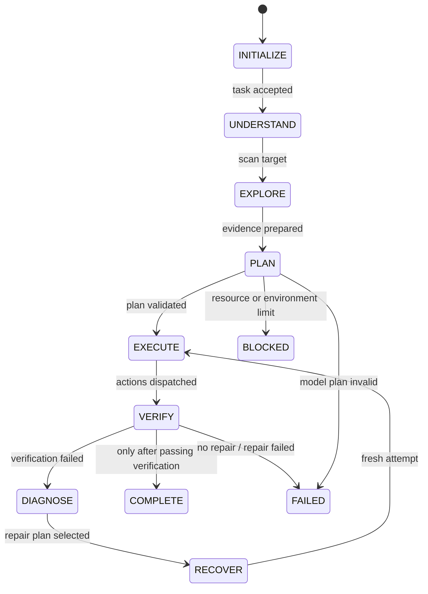
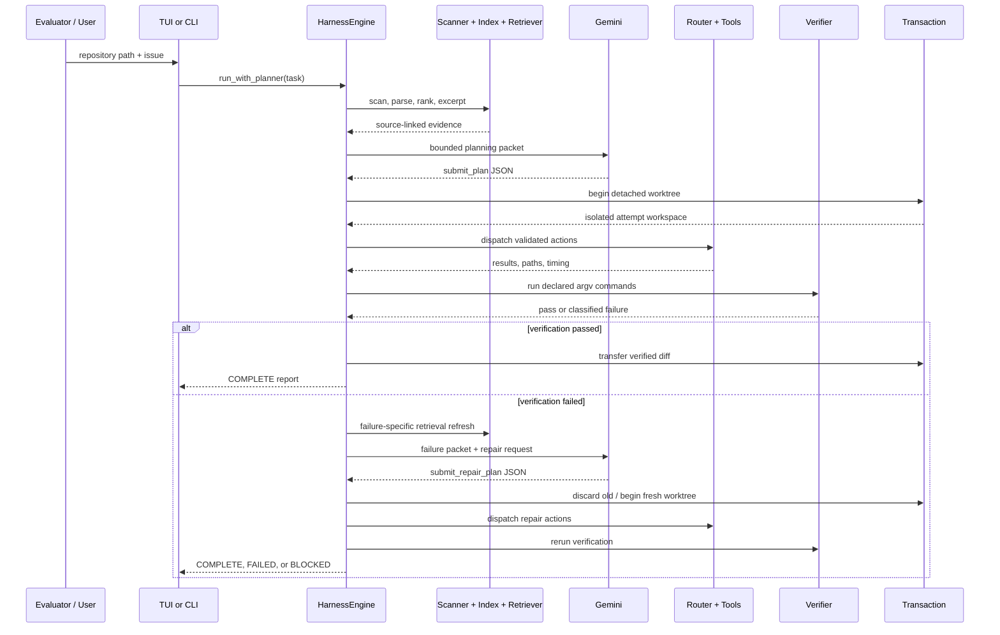
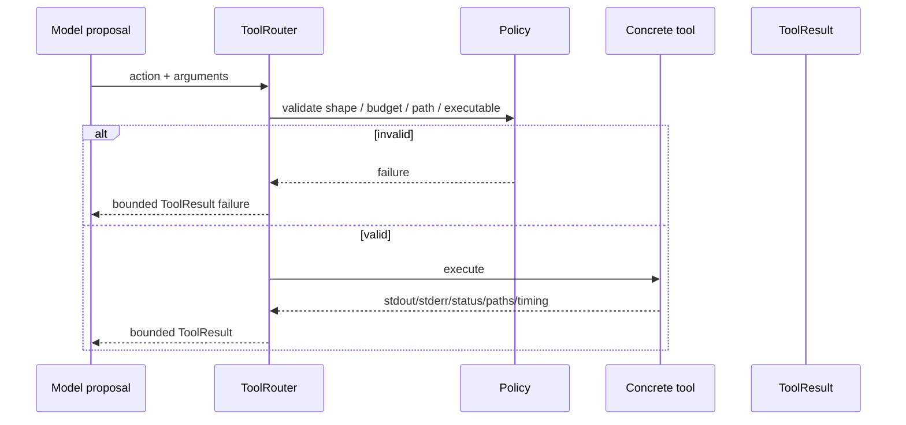
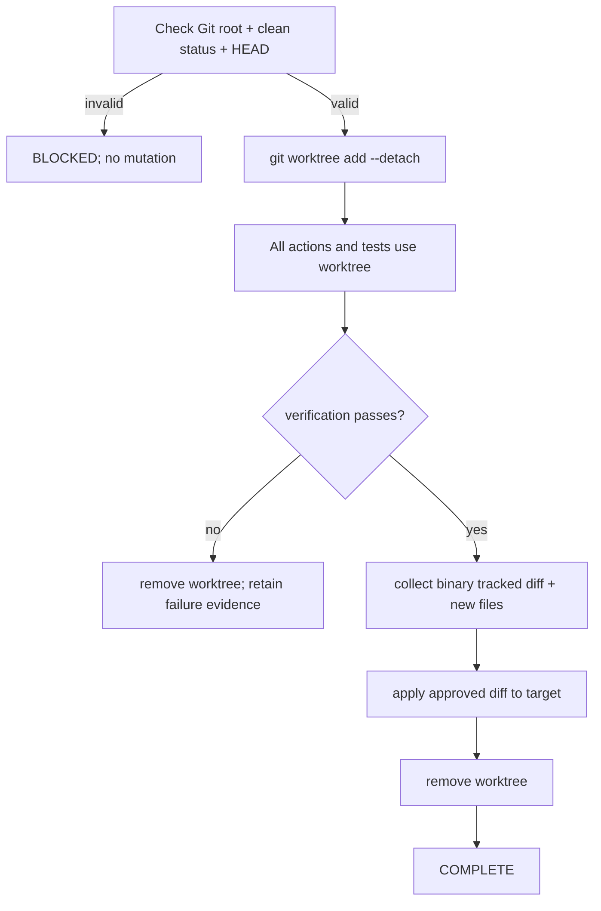

# SecondEgo — Current Architecture, Explained in Detail

**Document type:** temporary architecture reference
**Status:** describes the implementation currently in the repository, not every idea in the design proposals
**Temporary file:** this document is intentionally uncommitted unless explicitly requested

## 1. The one-sentence mental model

SecondEgo is a local coding-agent application. The final engine direction is Rust: it receives a software issue and a separate target repository, asks a provider for a structured coding plan, executes only validated actions inside an isolated bounded workspace, runs verification commands, and finishes only after collecting evidence. Python remains the verified compatibility/reference runtime during the migration.

The model proposes. The runtime decides whether the proposal is allowed, where it runs, whether tests pass, whether a retry is justified, whether changes are transferred, and whether the run is complete.

```text
                    MODEL = proposes reasoning
                             |
                             v
ISSUE -> INDEX -> RETRIEVE -> VALIDATE -> ISOLATE -> EXECUTE -> VERIFY
  |                                                       |
  |                                                       v
  |                                                evidence / failure
  |                                                       |
  |                                                       v
  +--------------------------------------------- DIAGNOSE -> REPAIR
                                                          |
                                                          v
                                               pass -> transfer diff
                                               fail -> discard attempt
```

## 2. Two repositories are involved

This distinction is essential.

| Repository | What it contains | Who controls it |
| --- | --- | --- |
| Harness repository | SecondEgo source code, Makefile, provider adapter, tools, tests, evaluation fixture | us / the submission process |
| Target repository | The unfamiliar codebase and issue that SecondEgo must modify | the evaluator, or the local rehearsal setup |

The evaluator clones the harness repository. Then it supplies a target repository and an issue to the running harness. SecondEgo is not supposed to solve an issue inside its own harness repository during evaluation.

```text
HARNESS REPOSITORY
  Makefile -> make setup -> make run
  Rust engine -> provider boundary -> tools
                              |
                              v
                    TARGET REPOSITORY
                    source + tests + issue
                              |
                              v
                    verified final diff
```

The local rehearsal for this boundary is documented in [`evaluation/README.md`](../../evaluation/README.md). The deliberately buggy target is under [`evaluation/fixture_repo/`](../../evaluation/fixture_repo/).

## 3. Complete layer map

```text
                         ENTRY POINTS
                 Makefile / CLI / TUI
                              |
                              v
                    APPLICATION FACTORY
                 builds the concrete components
                              |
                              v
                       HARNESS ENGINE
             coordinates the complete execution run
                              |
        +---------------------+---------------------+
        |                     |                     |
        v                     v                     v
   CORE STATE            RESOURCE BUDGET      REPOSITORY INTELLIGENCE
   ExecutionState        ResourceUsage        scan / index / retrieve
   StateMachine                                  |
        |                                        v
        |                              CONTEXT ASSEMBLY
        |                              bounded evidence packet
        |                                        |
        |                                        v
        |                                  MODEL PLANNER
        |                                        |
        |                                        v
        |                                  MODEL PROVIDER
        |                                        |
        |                                        v
        |                                  GeminiProvider
        |
        +----------------------+----------------------+----------------+
        |                      |                      |                |
        v                      v                      v                v
    TOOL ROUTER          TRANSACTION LAYER      VERIFICATION       EVIDENCE
        |                GitAttemptTransaction    ENGINE           LEDGER
        v                      |                      |                |
   +----+-----+                |                      |                |
   |          |                |                      |                |
   v          v                v                      v                v
POLICIES   TOOLS        isolated Git worktree   tests/build/lint   source-linked
workspace  file/read   failed attempts are      and failure       records and
command    search      discarded safely         classification     summaries
           Git
        |                      |                      |                |
        +----------------------+----------------------+----------------+
                                                       |
                                                       v
                                           EVENTS + OPTIONAL SQLITE STORE
                                                       |
                                                       v
                                           TERMINAL RESULT / FINAL REPORT
```

The layers are intentionally separate:

1. **Entry layer:** starts a run and collects repository/task input.
2. **Application layer:** wires concrete implementations together.
3. **Core state layer:** stores run state, phases, terminal status, events, and budgets.
4. **Repository-intelligence layer:** scans, indexes, ranks, and excerpts target code.
5. **Context layer:** creates a bounded evidence packet for the model.
6. **Model layer:** converts bounded text context into validated structured proposals.
7. **Tool layer:** enforces file, command, search, and Git permissions.
8. **Transaction layer:** isolates every real coding attempt in a detached worktree.
9. **Verification layer:** runs tests/build/lint commands and classifies failures.
10. **Recovery layer:** retrieves failure-specific evidence and asks for one repair plan.
11. **Evidence/persistence layer:** records bounded evidence, events, diffs, and terminal state.

## 4. Entry points

### 4.1 Evaluator entry point: Makefile

The required commands are:

| Command | Current behavior |
| --- | --- |
| `make setup` | Creates `.venv`, installs the Python compatibility dependencies and project, and builds the Rust CLI/gateway in release mode |
| `make run` | Builds the Rust release CLI if needed, prompts for the repository path and issue, and runs the Rust engine; `ENGINE=python` selects the compatibility TUI |
| `make ui` | Explicitly builds and launches the optional macOS notch observer; UI is off by default |
| `make run UI=on` | Uses the same standard launcher with the optional notch observer enabled |
| `make test` | Runs the full contract suite with pytest |
| `make clean` | Removes generated virtualenv/build/cache artifacts |

`make run` does not itself contain an API key. The evaluator exports `AI_API_KEY` for Gemini-backed planning. A local `.env` file is ignored by Git, but the application does not automatically load it; a developer must source it into the process environment before local execution.

### 4.2 TUI

`src/SecondEgo/tui.py` performs the evaluator-style flow:

1. Print the text-only evaluation-mode banner.
2. Ask for the target repository path.
3. Ask for the issue text.
4. Build the production engine with transactions enabled.
5. Build the configured Gemini planner.
6. Run one autonomous harness execution.
7. Print a compact JSON result containing run ID, status, reason, changed paths, and verification status.

The TUI is deliberately text-only because the evaluation specification requires text-only model input/output.

### 4.3 CLI

`src/SecondEgo/cli.py` supports deterministic and provider-backed runs:

```text
secondego solve --repo TARGET --issue ISSUE --plan PLAN.json
secondego solve --repo TARGET --issue ISSUE --gemini --model MODEL
```

The deterministic plan mode is useful for repeatable tests. Gemini mode requests the model plan. The CLI can optionally write final state, events, and evidence to SQLite through `--state-db`.

## 5. Application wiring

`src/SecondEgo/app.py` is the composition root. It creates:

```text
Path
  -> WorkspacePolicy
  -> CommandRunner
  -> GitTool
  -> FileTool + SearchTool + ToolRouter
  -> VerificationEngine
  -> RepositoryScanner / RepositoryIndexer / RepositoryRetriever
  -> GitAttemptTransaction
  -> HarnessEngine
```

The important production default is `transactional=True` in `build_engine`. The TUI and CLI therefore use isolated Git attempts by default.

Resource defaults are:

| Resource | Default | Meaning |
| --- | ---: | --- |
| Model calls | 20 | Maximum provider calls permitted by the budget |
| Tool calls | 80 | Maximum routed model-tool actions |
| Retries | 6 | Global resource ceiling; the current dynamic planner path uses one recovery retry |
| Runtime | 900 seconds | Maximum elapsed run time |
| Context | 24,000 estimated tokens per model call | Maximum context estimate accepted by the runtime |

The actual model planner context budget is:

```text
total       = 24,000
task        =  4,000
action      =  2,000
evidence    = 12,000
state       =  3,000
response    =  3,000
```

## 6. Core state and state machine

`src/SecondEgo/core/state.py` defines the durable run state.

### 6.1 ExecutionState

Each run has:

- `run_id`: unique UUID.
- `task`: issue text supplied by the user/evaluator.
- `workspace`: canonical target path.
- `acceptance_criteria`: required outcomes.
- `phase`: current lifecycle phase.
- `status`: running or terminal status.
- `changed_paths`: paths approved into the final target result.
- `facts`: structured facts retained by the runtime.
- `decisions`: decisions and rationale slots.
- `open_questions`: unresolved questions.
- `failed_approaches`: approaches that did not work.
- `retry_counts`: retry accounting.
- `resource_usage`: model/tool/retry/context/runtime counters.
- `evidence_refs`: links to ledger evidence.
- `termination_reason`: why the run stopped.

`snapshot()` returns only bounded structured state. It intentionally does not store a raw transcript.

### 6.2 Phases



Allowed transitions are enforced by `StateMachine`. A terminal run cannot transition again. Every transition requires a non-empty reason and produces an `EngineEvent`.

### 6.3 Terminal statuses

| Status | Meaning |
| --- | --- |
| `COMPLETE` | Verification passed and the approved diff was transferred when transactions are enabled |
| `FAILED` | The run executed but could not produce a verified result |
| `BLOCKED` | Safe execution was impossible, for example dirty/non-Git target or exhausted budget |
| `CANCELLED` | Reserved terminal state for cancellation behavior |
| `RUNNING` | Non-terminal state during execution |

## 7. Run lifecycle in detail



## 8. Repository intelligence

Repository intelligence is deterministic. The model does not decide which files exist, and it does not receive an uncontrolled repository dump.

### 8.1 Scanner

`RepositoryScanner` performs a cheap structural scan:

- Lists files under the configured workspace.
- Stops after 20,000 files.
- Detects `pyproject.toml`, `package.json`, `pytest.ini`, `tox.ini`, and `setup.cfg`.
- Detects Python/JavaScript/TypeScript test files by naming and directory conventions.
- Ignores `.git`, `.venv`, `node_modules`, `__pycache__`, `dist`, and `build` directories.

Unsupported languages are still visible through paths and lexical search, but they do not receive Python AST metadata.

### 8.2 Python index

`RepositoryIndexer` builds rebuildable metadata:

| Record | Meaning |
| --- | --- |
| `Symbol` | Function/class name, kind, file, start line, end line |
| `ImportEdge` | Source file imports a module at a line |
| `ParserFailure` | Python file could not be parsed, with message and line if available |
| `TestNode` | A test-file function whose name begins with `test` |
| `TestLink` | A test file imports a target implementation path, with reason/confidence |

The index is local and derived. It is not a remote graph database and can be rebuilt from the target repository.

### 8.3 Retrieval scoring

`RepositoryRetriever` extracts identifier-like terms from the issue or failure text and ranks files explainably.

| Signal | Current effect |
| --- | ---: |
| Term appears in path | +3 |
| Term appears in indexed symbol | +5 |
| Test file for test/bug/fix/regression query | +1 |
| Target is linked from a matching test path | +7 |
| Failure mode and test topology applies | +2 |
| Matching test path in failure mode | +8 |

Results include `path`, `score`, `reasons`, and a confidence value. Current engine retrieval is capped at eight results.

After ranking, the engine reads at most roughly 2,500 characters from safe candidate files and attaches the excerpt to source-linked evidence. Sensitive filenames such as `.env` and `credentials.json` are excluded from excerpts, and common credential assignments are redacted.

```text
issue text
   |
   v
terms -> paths + symbols + test links -> ranked candidates
                                      |
                                      v
                         bounded source excerpts
                                      |
                                      v
                              model context
```

## 9. Context management

### 9.1 EvidenceLedger

`EvidenceLedger` is a keyed collection of compact evidence records:

```text
EvidenceRecord = reference + summary + source + importance + stale flag
```

Examples:

- `repository:scan` — structural repository counts.
- `retrieval:0` — top task retrieval candidate and excerpt.
- `verification:0` — first verification command output.
- `verification:failure` — parsed failure facts.
- `diagnosis:failure` — recovery diagnosis input.
- `transaction:passed` or `transaction:discarded` — attempt outcome.
- `diff:final` — final target diff.

If the same reference is recorded again, the higher-importance record wins. Retry context retains active records and can mark old records stale.

### 9.2 ContextAssembler

The assembler receives:

- task text;
- one instruction describing the required model output;
- active evidence records;
- a serialized structured execution state.

It then:

1. Estimates tokens deterministically as approximately characters divided by four.
2. Rejects task/action/state slots that exceed their reserved budgets.
3. Sorts evidence by importance.
4. Skips stale evidence.
5. Skips evidence that would exceed the evidence slot.
6. Records the references that were omitted.
7. Reserves response capacity.
8. Produces a `ContextPacket` with slot usage and omitted evidence.

```text
MODEL CONTEXT PACKET
  TASK
  ACTION INSTRUCTION
  EVIDENCE
    [reference] summary (source)
  OMITTED_EVIDENCE
  STATE
```

Important limitation: token accounting is a deterministic estimate. The provider's `count_tokens()` protocol exists, but the planner does not make a separate provider token-count request.

## 10. Where the AI model is used

### 10.1 Initial planning call

The first Gemini call occurs in `ModelPlanner.create_plan()` after scanning, indexing, retrieval, and context assembly.

The model receives an instruction equivalent to:

```text
Return exactly one action named submit_plan.
Arguments:
  actions: [{action, arguments, rationale}, ...]
  verification_commands: [[argv, ...], ...]
  recovery_actions: optional list
Use only workspace-safe actions and argv arrays.
```

Gemini returns JSON under a generic schema:

```json
{
  "action": "submit_plan",
  "arguments": {
    "actions": [],
    "verification_commands": []
  },
  "rationale": "..."
}
```

The runtime validates the outer action, action entries, argument object types, non-empty command arrays, and string types before execution.

### 10.2 Diagnosis/recovery call

If the first attempt fails verification in provider-backed mode:

1. The runtime keeps the target untouched by discarding the failed worktree.
2. The verifier produces a `FailureRecord`.
3. The runtime stores the failure evidence.
4. The retriever searches again using failing test IDs, error locations, and bounded failure text.
5. The planner creates a new context packet.
6. Gemini receives an instruction to return `submit_repair_plan`.
7. The repair action list is validated.
8. The repair runs in a fresh transaction.

The recovery model is therefore called after observing reality. It is not asked to guess a recovery strategy before the first test result.

### 10.3 What the model does not control

The model does not control:

- repository root;
- path canonicalization;
- allowed executable list;
- shell usage;
- command timeout maximum;
- output-size limits;
- transaction creation/removal;
- whether a diff is transferred;
- failure classification;
- resource budgets;
- terminal status;
- API key storage;
- SQLite schema;
- evidence retention rules.

### 10.4 Deterministic provider

`ScriptedProvider` returns queued `ActionProposal` objects. It is used by contract tests to reproduce successful plans, failures, and repairs without network calls. This is not an AI model; it is the test double that makes the harness itself testable.

## 11. Action and tool execution

The model does not directly execute Python functions or shell strings. It emits an `ActionProposal` and the `ToolRouter` dispatches only recognized action names.

Current action names:

| Action | Runtime behavior |
| --- | --- |
| `read_file` | Read one UTF-8 file under the workspace, capped at 512 KB |
| `edit_file` | Write UTF-8 content under the workspace, capped at 512 KB |
| `search_code` | Case-insensitive text search with path/line/text results, capped at 100 matches |
| `run_command` | Run an allowlisted executable with argv, cwd, timeout, and captured output |
| `git_diff` | Collect a bounded Git diff |
| `git_status` | Collect short Git status |



## 12. Workspace and command security

### 12.1 WorkspacePolicy

Every relative path is joined to the configured root, expanded, canonicalized, and checked with `relative_to(root)`. Paths escaping the workspace are rejected.

### 12.2 CommandPolicy

Only these executable basenames are currently allowed:

```text
git, npm, pnpm, pytest, python, python3, ruff, uv
```

Commands use `shell=False`, so the model cannot submit a shell string and rely on shell expansion. Timeouts are positive and capped at 120 seconds. Output is capped at 256 KB per stream. Missing executables and timeouts become bounded failed `ToolResult` values.

### 12.3 Secrets

- The evaluator credential is read from `AI_API_KEY`.
- The model adapter never writes the key to source or logs.
- `.env` is ignored.
- SQLite evidence summaries are redacted for common credential assignments.
- Retrieval excerpts redact common credential assignments and skip sensitive filenames.

This is bounded redaction, not a perfect secret detector. The target repository remains untrusted input.

## 13. Transaction and rollback architecture

Transactions are enabled by `build_engine()` for the real CLI/TUI path.

### 13.1 Preconditions

The target must be:

- a Git repository;
- the repository root, not an arbitrary subdirectory;
- clean before the run;
- initialized with an initial `HEAD` commit.

If any condition fails, mutation is blocked.

### 13.2 Attempt lifecycle



Worktrees are created in a temporary directory such as `/tmp/secondego-attempt-*`, outside the target tree.

### 13.3 Failed attempt

On failure:

- edits remain only in the temporary worktree;
- the target remains at its baseline;
- the failed worktree is removed;
- failure output and changed-path evidence remain in memory/SQLite/report;
- recovery starts from a clean baseline.

### 13.4 Passing attempt

On success:

- tracked changes are collected with `git diff --binary`;
- the diff is size-limited;
- tracked changes are applied to the target;
- eligible new regular files are copied;
- generated directories and sensitive filenames are excluded;
- the worktree is removed;
- final target `git diff` is collected.

A direct `HarnessEngine` created manually without a transaction object can still run against its supplied workspace. The production application factory uses the transactional path.

## 14. Verification and failure handling

`VerificationEngine` runs declared argv commands sequentially. It stops at the first failing command.

Each command produces:

- exact argv;
- success/failure;
- exit code;
- duration;
- bounded combined output.

Failure classification currently checks text patterns in this order:

1. Environment: timeout, executable missing, `No module named`, missing file.
2. Build: `SyntaxError` or syntax error.
3. Type: mypy/type error markers.
4. Lint: lint/ruff markers.
5. Test: failed/assert markers.
6. Unknown.

A failed result also includes a `FailureRecord`:

| Field | Current meaning |
| --- | --- |
| `failure_class` | Deterministic category |
| `summary` | First bounded failure output |
| `failing_tests` | Regex-extracted `FAILED`/`ERROR` identifiers |
| `error_locations` | Regex-extracted source file and line locations |
| `fingerprint` | First non-empty output line |
| `changed_paths` | Reserved field; not yet populated by verifier |

```text
verification output
      |
      v
classify failure
      |
      +--> evidence record
      +--> failure record
      +--> diagnosis query
      +--> repair model call
```

Current limitation: pass/fail test counts are not parsed into `passed_tests` and `failed_tests`; the evidence still contains the test runner output.

## 15. Recovery architecture

There are two execution paths:

### Deterministic `run()` path

`HarnessEngine.run()` receives actions and optional recovery actions directly. It is useful for replayable plans and tests. If recovery actions are supplied, they run after a failure.

### Provider-backed `run_with_planner()` path

`HarnessEngine.run_with_planner()` requests the first model plan, then dynamically asks for repair after a real failure. This is the intended AI path.

```text
initial plan
   -> attempt 1
   -> verification fails
   -> failure record
   -> diagnosis retrieval
   -> submit_repair_plan call
   -> attempt 2
   -> verification
   -> complete / failed / blocked
```

The current provider-backed implementation allows one diagnosis-informed recovery attempt. It does not run a multi-agent debate, parallel branches, or unbounded loops.

## 16. Events, evidence, and persistence

### 16.1 Events

Events are immutable `EngineEvent` records with run ID, type, phase, timestamp, status, evidence reference, and payload.

Typical sequence:

```text
state.changed: UNDERSTAND
state.changed: EXPLORE
state.changed: PLAN
transaction.started
state.changed: EXECUTE
tool.completed
state.changed: VERIFY
verification.completed
transaction.finished
git.diff_collected
run.terminated
```

Recovery adds `DIAGNOSE`, `diagnosis:retrieval`, `RECOVER`, and another attempt sequence.

### 16.2 SQLite

`SQLiteRunStore` is optional and schema version 1. It stores:

- run metadata;
- serialized bounded state;
- ordered events;
- source-linked evidence summaries.

It deletes and rewrites events/evidence for the same run ID, so the saved run is a compact final snapshot rather than an unbounded append-only transcript.

### 16.3 Final report

The CLI report includes:

- run ID;
- terminal status and phase;
- termination reason;
- changed paths;
- resource usage;
- verification status/class/commands/failure record;
- events;
- evidence summaries and sources.

The TUI currently prints a smaller final JSON view. The engine result itself contains the full event/evidence collections.

## 17. Decision ownership table

| Decision | Made by | Checked by | Evidence |
| --- | --- | --- | --- |
| Which files are structurally present | Scanner | Workspace path policy | repository snapshot |
| Which Python symbols/imports/tests exist | AST indexer | Parser fallback/failure records | repository index |
| Which files are relevant | Deterministic retriever | Context budget | ranking reasons/confidence |
| What code change to attempt | Gemini or scripted provider | Plan parser + tool policy | `submit_plan` |
| Which tools can run | Runtime policy | ToolRouter | ToolResult |
| Where mutation happens | Transaction runtime | Git preflight | transaction events |
| Whether tests pass | VerificationEngine | command exit status | verification evidence |
| What failed | Failure classifier | bounded output parser | FailureRecord |
| Whether to repair | Gemini recovery planner | retry/resource limits | diagnosis packet + repair plan |
| Whether the run is complete | Runtime | state machine + verification | terminal event + diff |
| What is persisted | SQLite store | redaction and size caps | final state/events/evidence |

## 18. Exact AI versus deterministic flow

```mermaid
flowchart LR
    A[Issue text] --> D[Deterministic scan/index/retrieve]
    D --> P[Gemini plan call]
    P --> V[Schema validation]
    V --> X[Deterministic policy + tools]
    X --> T[Deterministic tests]
    T --> C{pass?}
    C -->|yes| F[Deterministic diff transfer + completion]
    C -->|no| G[Deterministic failure record + retrieval refresh]
    G --> R[Gemini repair call]
    R --> S[Schema validation]
    S --> Y[Deterministic fresh transaction + repair tools]
    Y --> Z[Deterministic verification]
    Z --> F
```



The AI is concentrated at two high-value reasoning points. All safety, state, evidence, and correctness decisions remain deterministic.

## 19. Current architecture strengths

- The target repository is isolated from failed attempts.
- Model output is structured and validated before tools run.
- Repository evidence is source-linked and ranked.
- Context is bounded and omitted evidence is visible.
- Verification is command-based rather than narration-based.
- Recovery is triggered by observed failure.
- API-key and provider failures do not crash the harness.
- Tests can use a deterministic scripted provider.
- The evaluator interface is standardized through the root Makefile.
- The architecture remains local and provider-agnostic.

## 20. Current limitations and planned work

These are real limitations in the current implementation:

1. **No generic iterative tool loop before planning.** The first model call returns a complete action list. The model cannot inspect a file, observe the result, and then decide its next action within the same planning phase.
2. **Python-first repository graph.** Other languages receive structural/lexical fallback, not AST symbols/test topology.
3. **Git-only production transactions.** Dirty/non-Git targets are blocked; the bounded journal fallback is not implemented.
4. **Failure parsing is regex-based.** It is useful but not a full test-runner parser.
5. **Test counts are not populated.** Output is retained, but numeric counts remain zero.
6. **TUI telemetry is compact.** The full event/evidence report is available in `EngineResult` and CLI output; the TUI does not yet render every record.
7. **SQLite is final-run persistence, not live streaming.** There is no resume protocol or incremental event consumer yet.
8. **The Electron/React shell is observer-only.** The first shell now exists and builds, but packaging and broader cross-process integration remain; it is intentionally not part of the text-only evaluator path.
9. **No voice, vision, ElevenLabs, OpenCV, vector database, Neo4j, or multi-agent layer.** Those are not justified by the current text-only coding-task evaluation.

## 21. Current readiness statement

The current project is an evaluator-oriented headless harness foundation with a working deterministic rehearsal and a bounded Gemini integration. It is not yet a general-purpose autonomous coding IDE.

The strongest current demo is:

```text
separate target repository
    -> issue
    -> ranked repository evidence
    -> structured plan
    -> isolated edit
    -> tests
    -> failure or pass
    -> diagnosis-informed repair
    -> verified diff
```

The architecture is deliberately optimized for explainability, safety, and reliable completion under a short hackathon evaluation rather than maximum agent autonomy.

## 22. Rust engine migration status

The Rust workspace is now executable in staged form under `engine-rs/`:

```text
secondego-core        -> phases, terminal states, events, budgets
secondego-repository  -> bounded scan, Tree-sitter index, tests, imports, retrieval
secondego-context     -> evidence ledger and context packet budgets
secondego-model       -> scripted provider plus Gemini REST adapter
secondego-tools       -> workspace policy, file/search/command/Git tools, worktree transaction
secondego-verification-> evidence, failure classes, bounded verification
secondego-runtime     -> index -> context -> plan -> execute -> verify -> recover
secondego-storage     -> SQLite run and event persistence
secondego-cli         -> replayable and Gemini-backed Rust entry point
```

The Rust fixture test proves the critical invariant: a failed attempt is discarded,
while a verified attempt transfers its diff. The Rust CLI is exposed through the
default `make run` path and the explicit `make rust-run` development command; the
existing Python commands remain an explicit compatibility path.

Indexing is deliberately before planning. The Rust index records file manifests,
Python symbols, imports, test nodes, test-to-code links, parser failures, and
explainable retrieval reasons. It is bounded and rebuildable; it does not dump the
repository into the model context.

## 23. Presentation modes and the first UI slice

The engine now has an explicit presentation boundary:

```text
make run                  -> Rust headless/default evaluator path
make run UI_MODE=events   -> same run plus compact event display
make run UI=on            -> explicit opt-in notch observer
make desktop              -> optional loopback browser observer
```

The event observer receives serialized `EngineEvent` objects. It cannot execute
tools, alter state transitions, change budgets, or make model calls. Observer
failures are swallowed by the engine event log, so a disconnected UI cannot turn
a successful coding run into a failed run.

The current `secondego-desktop` command remains a dependency-free browser observer
and Python compatibility gateway. The Electron shell now prefers the Rust
`secondego-gateway` binary and falls back to Python only when that binary is not
available. Both implement the versioned `/api/runs` observer contract; the Rust
gateway accepts bounded repository/issue requests, runs the Rust engine in a
background worker, exposes status/event polling, binds only to loopback, and
requires a per-process token.

The future Electron/React shell must consume this same boundary. It must remain a
presentation and bounded-control surface, never a second orchestrator.
